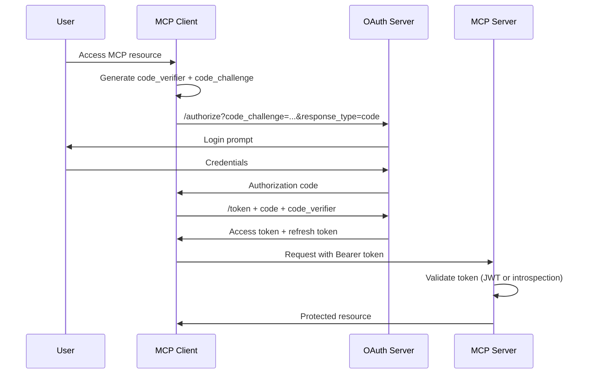
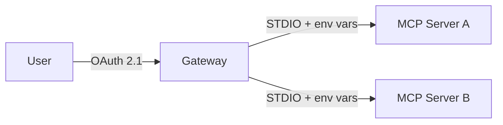
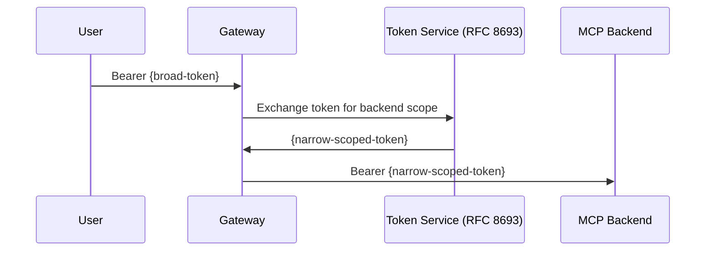
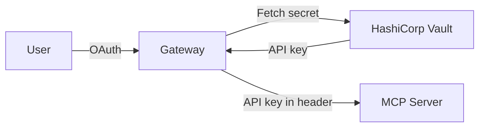

# MCP Authentication Guide

## Overview

MCP authentication varies significantly by transport mechanism. Understanding these differences is critical for secure deployment.

**Key Principles:**

* **STDIO Transport**: Uses environment variables for credentials. OAuth is explicitly prohibited by the MCP specification (section on security considerations).
* **HTTP/SSE Transport**: OAuth 2.1 with PKCE is mandatory per the 2025-06-18 specification update for all public clients.
* **Security Model**: Client-side authentication (user ↔ MCP server) is separate from backend service authentication (MCP server ↔ APIs).

## Quick Reference

### By Transport Type

| Transport | Auth Method | Spec Requirement | Use Case |
|-----------|-------------|------------------|----------|
| STDIO | Environment variables | OAuth SHOULD NOT be used | Local servers, dev environments |
| HTTP | OAuth 2.1 + PKCE | Mandatory | Web applications, public clients |
| SSE | OAuth 2.1 + PKCE | Mandatory | Real-time streaming apps |

### Tool Authentication Support Matrix

| Tool | OAuth 2.1 | Bearer Token | API Key | Auth Bridging | RBAC | Enterprise SSO |
|------|-----------|--------------|---------|---------------|------|----------------|
| microsoft/mcp-gateway | ✅ Full | ✅ | ❌ | ✅ Entra ID | ✅ | ✅ Azure AD |
| lasso-security/mcp-gateway | ❌ | ✅ | ✅ | ✅ Vault | ✅ | ✅ OIDC |
| sparfenyuk/mcp-proxy | ❌ | ✅ | ✅ | ✅ Headers | ❌ | ❌ |
| open-webui/mcpo | ✅ PKCE | ✅ | ❌ | ❌ | ❌ | ❌ |
| Azure API Mgmt | ✅ Full | ✅ | ✅ | ✅ Native | ✅ | ✅ Entra ID |
| modelcontextprotocol/servers | ❌ | ❌ | ✅ Env | ❌ | ❌ | ❌ |
| @cloudflare/mcp-server-cloudflare | ❌ | ❌ | ✅ Env | ❌ | ❌ | ❌ |
| @anthropic/mcp-server-github | ❌ | ❌ | ✅ Env | ❌ | ❌ | ❌ |
| mcp-cli | ✅ PKCE | ✅ | ✅ | ❌ | ❌ | ❌ |

**Legend:**

* ✅ Full = Complete implementation with token refresh, PKCE, dynamic registration
* ✅ PKCE = OAuth with PKCE support (minimum for public clients)
* ✅ = Supported
* ❌ = Not supported

## OAuth 2.1 Flow (HTTP Transport)

### Standard Authorization Code Flow with PKCE



### Key Requirements (MCP Spec 2025-06-18)

**Mandatory for HTTP/SSE:**

* PKCE with S256 hash algorithm (prevents authorization code interception)
* Resource Indicators (RFC 8707) - specify target MCP server in token audience
* Dynamic Client Registration (RFC 7591) OR Client Identity Metadata Discovery (CIMD)
* Short-lived access tokens (recommended 15-60 minutes)
* Refresh token rotation (new refresh token issued on each use)

**Optional but Recommended:**

* Token Binding (RFC 8473) - cryptographically bind tokens to TLS connections
* Mutual TLS (mTLS) for client authentication
* JWT access tokens with signature verification (avoid introspection overhead)

### Step-Up Authorization

When an MCP server returns `403 Forbidden` with `insufficient_scope` error:

```json
{
  "error": {
    "code": "insufficient_scope",
    "message": "Requires scope: mcp:filesystem:write",
    "required_scope": "mcp:filesystem:write"
  }
}
```

**Client Response:**

1. Detect `insufficient_scope` error
2. Initiate new OAuth flow with additional scope
3. User consents to elevated permissions
4. Retry original request with new token

**Implementations:**

* **microsoft/mcp-gateway**: Full step-up support with Azure AD conditional access
* **lasso-security/mcp-gateway**: Manual scope upgrade required
* **open-webui/mcpo**: No step-up support (fails request)

## Environment Variable Auth (STDIO)

### Standard Pattern

MCP clients load environment variables when spawning STDIO servers:

```json
{
  "mcpServers": {
    "github": {
      "command": "npx",
      "args": ["-y", "@anthropic/mcp-server-github"],
      "env": {
        "GITHUB_PERSONAL_ACCESS_TOKEN": "${env:GITHUB_PERSONAL_ACCESS_TOKEN}"
      }
    },
    "supabase": {
      "command": "npx",
      "args": ["-y", "@modelcontextprotocol/server-supabase"],
      "env": {
        "SUPABASE_URL": "${env:SUPABASE_URL}",
        "SUPABASE_SERVICE_ROLE_KEY": "${env:SUPABASE_SERVICE_ROLE_KEY}"
      }
    }
  }
}
```

### Common Environment Variables by Service

| Service | Variable Name | Format | Scopes |
|---------|---------------|--------|--------|
| GitHub | `GITHUB_PERSONAL_ACCESS_TOKEN` | `ghp_...` | repo, read:org, gist |
| GitLab | `GITLAB_API_TOKEN` | `glpat-...` | api, read_repository |
| Supabase | `SUPABASE_SERVICE_ROLE_KEY` | JWT | Full database access |
| Cloudflare | `CLOUDFLARE_API_TOKEN` | API token | Zone:Read, DNS:Edit |
| Kubernetes | `KUBECONFIG` | File path | Cluster admin |
| PostgreSQL | `DATABASE_URL` | Connection string | Database credentials |
| Slack | `SLACK_BOT_TOKEN` | `xoxb-...` | chat:write, channels:read |
| Google | `GOOGLE_APPLICATION_CREDENTIALS` | JSON file path | Service account |

### Security Considerations

**Risks with STDIO Environment Variables:**

* **Plaintext Storage**: Most MCP clients store config with `${env:VAR}` references, but actual values are in shell profiles
* **Process Visibility**: Environment variables visible in `ps` output and `/proc/[pid]/environ`
* **Log Leakage**: May appear in debug logs, crash dumps, error messages
* **Child Process Inheritance**: All child processes inherit environment

**Mitigation Strategies:**

1. **Use OS Keychain**: Store sensitive values in system keychain, not shell files
2. **Temporary Injection**: Load credentials only when spawning MCP server process
3. **Restrict Process Permissions**: Use cgroups/namespaces to isolate server process
4. **Audit Logging**: Monitor access to credential environment variables
5. **Rotation**: Regularly rotate API tokens and service account keys

### Why OAuth is Prohibited for STDIO

From MCP specification security considerations:

> "OAuth flows require user interaction and redirect URIs, which are incompatible with stdio transport's process model. Servers using stdio SHOULD authenticate via environment variables containing pre-authorized tokens."

**Rationale:**

* No web browser context for authorization redirect
* Process spawning is synchronous (can't wait for user OAuth consent)
* No secure channel to receive authorization code callback
* STDIO servers often run as background daemons (no user interaction)

## Auth Bridging Patterns

"Auth bridging" solves the problem: **How do gateways/proxies handle authentication for backend MCP servers that don't support OAuth?**

### Pattern 1: Gateway OAuth Termination

**Implementation**: Gateway authenticates user via OAuth, then injects credentials for STDIO backends.



**Example (microsoft/mcp-gateway):**

```yaml
# Gateway config
oauth:
  provider: azure-ad
  client_id: "..."

backends:
  github:
    transport: stdio
    command: npx
    args: ["-y", "@anthropic/mcp-server-github"]
    credential_injection:
      type: environment
      source: vault  # Retrieve from Azure Key Vault
      mapping:
        GITHUB_PERSONAL_ACCESS_TOKEN: "github-token-{user.oid}"
```

**Flow:**

1. User authenticates to gateway via Azure AD OAuth
2. Gateway validates JWT, extracts user identity (`user.oid`)
3. On MCP server spawn, gateway retrieves GitHub token from Key Vault using user identity
4. Gateway spawns STDIO server with `GITHUB_PERSONAL_ACCESS_TOKEN` environment variable
5. GitHub MCP server uses token to call GitHub API

**Advantages:**

* Users only authenticate once (OAuth to gateway)
* Backend tokens stored securely in vault, not in client config
* Per-user token isolation (multi-tenant safe)
* Centralized token rotation and revocation

**Implementations:**

* **microsoft/mcp-gateway**: Azure Key Vault integration
* **lasso-security/mcp-gateway**: HashiCorp Vault integration
* **Azure API Management**: Native Azure AD integration

### Pattern 2: Token Exchange (RFC 8693)

**Implementation**: Exchange broad OAuth token for narrowly-scoped backend tokens.



**Example (lasso-security/mcp-gateway):**

```yaml
auth:
  token_exchange:
    enabled: true
    sts_endpoint: "https://sts.example.com/token"
    subject_token_type: "urn:ietf:params:oauth:token-type:jwt"

backends:
  filesystem:
    auth:
      type: token_exchange
      requested_token_type: "urn:ietf:params:oauth:token-type:access_token"
      scope: "filesystem:read filesystem:write"
      audience: "https://mcp.example.com/filesystem"
```

**Flow:**

1. Gateway receives JWT from user (broad scope: `mcp:*`)
2. Gateway calls STS with token exchange request
3. STS validates original token, issues new token with narrow scope (`filesystem:read filesystem:write`)
4. Gateway forwards narrow-scoped token to backend MCP server
5. Backend validates token audience matches its endpoint

**Advantages:**

* Principle of least privilege (backend tokens have minimal scope)
* Standardized RFC 8693 protocol
* No credential storage required (tokens are derived)
* Audit trail (STS logs all exchanges)

**Implementations:**

* **lasso-security/mcp-gateway**: Full RFC 8693 support
* **Azure API Management**: Azure AD token exchange

### Pattern 3: Vault Integration

**Implementation**: Gateway retrieves credentials from secrets vault on behalf of authenticated user.



**Example (lasso-security/mcp-gateway with Vault):**

```yaml
vault:
  address: "https://vault.example.com"
  auth:
    type: kubernetes
    role: mcp-gateway

backends:
  stripe:
    auth:
      type: vault
      path: "secret/data/mcp/stripe/{{.User.Email}}"
      key: "api_key"
      inject_as: header
      header_name: "Authorization"
      header_value: "Bearer {{.Credential}}"
```

**Flow:**

1. User authenticates to gateway (email: `alice@example.com`)
2. Gateway authenticates to Vault using Kubernetes service account
3. Gateway requests secret at `secret/data/mcp/stripe/alice@example.com`
4. Vault returns API key (per-user credential)
5. Gateway spawns MCP server and injects `Authorization: Bearer sk_live_...` header

**Advantages:**

* Centralized secret management
* Dynamic secret generation (Vault can generate temporary credentials)
* Audit logging (Vault logs all secret access)
* Secret rotation without config changes

**Implementations:**

* **lasso-security/mcp-gateway**: Native Vault support
* **microsoft/mcp-gateway**: Azure Key Vault (similar pattern)

### Pattern Comparison

| Pattern | Complexity | Security | Performance | Multi-Tenant |
|---------|------------|----------|-------------|--------------|
| OAuth Termination | Low | High (vault-backed) | Fast | ✅ |
| Token Exchange (RFC 8693) | Medium | Very High | Medium (STS call) | ✅ |
| Vault Integration | Medium | Very High | Medium (vault call) | ✅ |
| Header Injection | Very Low | Low (static creds) | Very Fast | ❌ |

## Enterprise Authentication

### Microsoft Entra ID (Azure AD) Integration

**Full-Featured Implementations:**

* **microsoft/mcp-gateway**: Native Entra ID support with conditional access policies
* **Azure API Management MCP**: Deep integration with Azure AD B2C and enterprise tenants

**Example Configuration (microsoft/mcp-gateway):**

```yaml
auth:
  provider: azure-ad
  tenant_id: "common"  # Multi-tenant
  client_id: "12345678-1234-1234-1234-123456789abc"
  client_secret: "${env:AZURE_CLIENT_SECRET}"
  scopes:
    - "https://mcp.example.com/mcp.read"
    - "https://mcp.example.com/mcp.write"

  conditional_access:
    enabled: true
    require_mfa: true
    allowed_locations: ["US", "EU"]
    device_compliance: required

  token_validation:
    issuer: "https://login.microsoftonline.com/{tenant_id}/v2.0"
    audience: "api://mcp-gateway"
    signature_validation: true
    claims_validation:
      - claim: "groups"
        values: ["mcp-users", "mcp-admins"]
```

**Features:**

* Multi-factor authentication (MFA) enforcement
* Conditional access policies (IP restrictions, device compliance)
* Group-based authorization
* Token caching and refresh
* Azure Key Vault integration for backend credentials

### RBAC (Role-Based Access Control) Patterns

#### Tool-Level RBAC

**microsoft/mcp-gateway** example:

```yaml
rbac:
  roles:
    admin:
      permissions:
        - "mcp:*:*"
    developer:
      permissions:
        - "mcp:filesystem:read"
        - "mcp:filesystem:write"
        - "mcp:github:*"
    analyst:
      permissions:
        - "mcp:database:read"
        - "mcp:slack:read"

  mappings:
    # Azure AD group → role
    "00000000-0000-0000-0000-000000000001": admin
    "00000000-0000-0000-0000-000000000002": developer
    "00000000-0000-0000-0000-000000000003": analyst
```

**lasso-security/mcp-gateway** example (OPA-based):

```yaml
authorization:
  engine: open_policy_agent
  policy_bundle_url: "https://policy.example.com/bundles/mcp"

  # OPA policy input
  input_mapping:
    user: "{{.JWT.sub}}"
    groups: "{{.JWT.groups}}"
    tool: "{{.Request.Tool}}"
    resource: "{{.Request.Resource}}"
```

**Rego Policy (OPA):**

```rego
package mcp.authz

import future.keywords.if
import future.keywords.in

default allow := false

# Admins can do anything
allow if {
    "mcp-admins" in input.groups
}

# Developers can read/write filesystem and GitHub
allow if {
    "developers" in input.groups
    input.tool in ["filesystem", "github"]
}

# Analysts can only read database
allow if {
    "analysts" in input.groups
    input.tool == "database"
    input.resource.action == "read"
}
```

#### Resource-Level RBAC

**Fine-grained permissions** (per-tool, per-resource):

```yaml
rbac:
  policies:
    - subject: "user:alice@example.com"
      tool: "github"
      resources:
        - "repos/myorg/*"  # All repos in myorg
      actions: ["read", "write"]

    - subject: "group:analysts"
      tool: "database"
      resources:
        - "tables/sales/*"
        - "tables/analytics/*"
      actions: ["read"]

    - subject: "group:developers"
      tool: "filesystem"
      resources:
        - "/home/{{user.name}}/*"  # User's home directory only
      actions: ["read", "write", "delete"]
```

### Multi-Tenant Patterns

#### Pattern 1: Tenant Isolation via Token Claims

**Implementation**: Include tenant ID in JWT claims, enforce isolation at gateway.

```yaml
multi_tenant:
  enabled: true
  tenant_claim: "tid"  # Azure AD tenant ID claim
  isolation: strict

backends:
  github:
    env:
      GITHUB_PERSONAL_ACCESS_TOKEN: "vault:secret/tenants/{{.Tenant}}/github"
```

**Flow:**

1. User authenticates (JWT includes `tid: "tenant-a"`)
2. Gateway extracts tenant ID from token
3. Gateway retrieves tenant-specific GitHub token from vault path `secret/tenants/tenant-a/github`
4. Responses cached per-tenant (no cross-tenant cache poisoning)

#### Pattern 2: Separate Backend Instances

**Implementation**: Deploy separate MCP server instances per tenant.

```yaml
multi_tenant:
  enabled: true
  tenant_routing:
    type: backend_instance

backends:
  tenant_a:
    command: npx
    args: ["-y", "@anthropic/mcp-server-github"]
    env:
      GITHUB_PERSONAL_ACCESS_TOKEN: "${env:TENANT_A_GITHUB_TOKEN}"
    allowed_tenants: ["tenant-a"]

  tenant_b:
    command: npx
    args: ["-y", "@anthropic/mcp-server-github"]
    env:
      GITHUB_PERSONAL_ACCESS_TOKEN: "${env:TENANT_B_GITHUB_TOKEN}"
    allowed_tenants: ["tenant-b"]
```

**Advantages:**

* Complete isolation (no cross-tenant data leakage)
* Per-tenant resource limits and billing
* Independent scaling and updates

**Disadvantages:**

* Higher resource usage (N backend processes for N tenants)
* Complex configuration management

## Client Authentication Support

### Desktop Clients

| Client | OAuth Support | Token Refresh | Secure Storage | Notes |
|--------|---------------|---------------|----------------|-------|
| Claude Desktop | Partial | Via SDK only | **Plaintext config** | Uses `~/.claude/config.json` |
| Cursor | Buggy | None | **Plaintext config** | OAuth flow often fails |
| VS Code MCP | Full | Automatic | OS Keychain | Uses `SecretStorage` API |
| Zed | Partial | None | Plaintext | Experimental MCP support |
| Windsurf | None | N/A | N/A | STDIO only, no OAuth |

### CLI Tools

| Client | OAuth Support | Token Refresh | Secure Storage | PKCE | Notes |
|--------|---------------|---------------|----------------|------|-------|
| mcp-cli | ✅ Full PKCE | ✅ Automatic | ✅ OS Keychain | ✅ | Reference implementation |
| @anthropic/mcp SDK | ✅ Library only | ✅ Configurable | ❌ App responsibility | ✅ | Provides OAuth primitives |
| curl/httpie | ❌ | ❌ | ❌ | ❌ | Manual Bearer token only |

### Web Clients

| Client | OAuth Support | Token Refresh | Secure Storage | Notes |
|--------|---------------|---------------|----------------|-------|
| open-webui/mcpo | ✅ PKCE | ✅ Automatic | Browser localStorage | Web app, follows spec |
| Custom frontends | Varies | Varies | Browser storage | Depends on implementation |

### Security Comparison

**Secure Storage Methods:**

1. **OS Keychain** (Best):
   * macOS: Keychain Access
   * Windows: Credential Manager
   * Linux: libsecret (GNOME Keyring, KWallet)
   * Encrypted at rest, requires OS authentication

2. **Plaintext Config** (Risky):
   * `~/.claude/config.json` readable by any process
   * `~/.cursor/config.json` world-readable on some systems
   * Tokens visible in backups, file sharing, malware

3. **Browser Storage** (Medium):
   * localStorage vulnerable to XSS
   * Cookies with HttpOnly flag are safer
   * Browser extension isolation helps

**Recommendation**: Prefer CLI tools (mcp-cli) or VS Code for sensitive deployments.

## Security Best Practices

### 1. Token Lifecycle Management

**Use Short-Lived Access Tokens:**

* Recommended: 15-60 minutes for access tokens
* Refresh tokens: 7-90 days with rotation
* Rationale: Limits damage from token leakage

**Example (OAuth Server Config):**

```yaml
token_lifetimes:
  access_token: 3600  # 1 hour
  refresh_token: 604800  # 7 days
  refresh_token_rotation: true
  refresh_token_reuse_window: 60  # 1 minute grace period
```

### 2. Credential Storage

**DO:**

* ✅ Store tokens in OS keychain (macOS Keychain, Windows Credential Manager, Linux libsecret)
* ✅ Use environment variables for STDIO servers (not in config files)
* ✅ Encrypt configuration files containing credentials
* ✅ Use vault services (HashiCorp Vault, Azure Key Vault) for production

**DON'T:**

* ❌ Store plaintext tokens in `~/.config/mcp/config.json`
* ❌ Commit credentials to version control
* ❌ Log tokens (even at DEBUG level)
* ❌ Pass tokens as CLI arguments (visible in `ps`)

### 3. OAuth Security (HTTP/SSE Transport)

**PKCE for All Public Clients:**

```javascript
// Generate code_verifier (random string)
const codeVerifier = base64url(crypto.randomBytes(32));

// Generate code_challenge (SHA256 hash)
const codeChallenge = base64url(
  crypto.createHash('sha256')
    .update(codeVerifier)
    .digest()
);

// Authorization request
const authUrl = `${authEndpoint}?` +
  `response_type=code&` +
  `client_id=${clientId}&` +
  `redirect_uri=${redirectUri}&` +
  `code_challenge=${codeChallenge}&` +
  `code_challenge_method=S256&` +
  `scope=${scope}`;
```

**Token Validation:**

```javascript
// Validate JWT access token
const decoded = jwt.verify(token, publicKey, {
  algorithms: ['RS256'],
  issuer: 'https://auth.example.com',
  audience: 'https://mcp.example.com',
  clockTolerance: 60  // 1 minute clock skew tolerance
});

// Validate required claims
if (!decoded.sub || !decoded.scope) {
  throw new Error('Invalid token: missing required claims');
}

// Validate Resource Indicator (RFC 8707)
if (decoded.aud !== 'https://mcp.example.com') {
  throw new Error('Token not intended for this MCP server');
}
```

### 4. Validate Token Audience (RFC 8707)

**Why It Matters:**

Without Resource Indicators, a token for `api.example.com` could be misused at `evil.example.com`. RFC 8707 binds tokens to specific resource servers.

**Authorization Request:**

```http
GET /authorize?
  response_type=code&
  client_id=abc123&
  redirect_uri=https://app.example.com/callback&
  resource=https://mcp.example.com&  <!-- Resource Indicator -->
  scope=mcp:read mcp:write
```

**Token Response:**

```json
{
  "access_token": "eyJ...",
  "token_type": "Bearer",
  "expires_in": 3600,
  "scope": "mcp:read mcp:write",
  "aud": "https://mcp.example.com"  // Audience claim matches resource
}
```

**Server Validation:**

```python
def validate_token(token: str):
    payload = jwt.decode(
        token,
        public_key,
        algorithms=['RS256'],
        audience='https://mcp.example.com'  # MUST match
    )
    return payload
```

### 5. Never Pass Tokens to Downstream APIs

**Anti-Pattern (Dangerous):**

```javascript
// BAD: Forwarding user's MCP token to GitHub API
async function listRepos(userToken) {
  const response = await fetch('https://api.github.com/user/repos', {
    headers: {
      'Authorization': `Bearer ${userToken}`  // WRONG! Token not for GitHub
    }
  });
}
```

**Why It's Dangerous:**

* Token intended for MCP server, not GitHub API
* Violates principle of least privilege
* If GitHub endpoint is compromised, attacker gets MCP access

**Correct Pattern (Auth Bridging):**

```javascript
// GOOD: MCP server has its own GitHub credentials
async function listRepos(userIdentity) {
  // Retrieve GitHub token from vault using user identity
  const githubToken = await vault.getSecret(
    `github/tokens/${userIdentity}`
  );

  const response = await fetch('https://api.github.com/user/repos', {
    headers: {
      'Authorization': `Bearer ${githubToken}`  // Separate credential
    }
  });
}
```

### 6. Additional Recommendations

**Network Security:**

* Use TLS 1.3 for all HTTP/SSE connections
* Pin OAuth server certificates (prevent MITM)
* Implement rate limiting (prevent token brute force)

**Monitoring:**

* Log all authentication attempts (success and failure)
* Alert on unusual token usage patterns
* Monitor token refresh rates (detect token theft)

**Disaster Recovery:**

* Have token revocation process
* Support emergency credential rotation
* Maintain offline access for critical systems

## Troubleshooting

### Common Issues

#### 1. Token Expired But No Refresh

**Symptoms:**

```
Error: 401 Unauthorized
{
  "error": "invalid_token",
  "error_description": "Token has expired"
}
```

**Causes:**

* Client doesn't support refresh tokens
* Refresh token also expired
* OAuth server doesn't issue refresh tokens

**Solutions:**

* **Short-term**: Manually re-authenticate
* **Long-term**: Use client with automatic refresh (mcp-cli, VS Code)
* **Check client logs**: `~/.mcp/logs/` or `--debug` flag

```bash
# Test token refresh manually
curl -X POST https://auth.example.com/token \
  -d grant_type=refresh_token \
  -d refresh_token="{REFRESH_TOKEN}" \
  -d client_id="{CLIENT_ID}"
```

#### 2. OAuth Flow Not Completing

**Symptoms:**

* Browser opens, redirects to auth server, then nothing
* Error: "Redirect URI mismatch"
* Error: "Invalid state parameter"

**Causes:**

* Redirect URI not registered in OAuth server
* Localhost port already in use
* Browser blocking redirect (privacy settings)
* State parameter mismatch (CSRF protection)

**Solutions:**

```bash
# Check registered redirect URIs
curl https://auth.example.com/.well-known/oauth-authorization-server | jq .redirect_uris

# Test with explicit redirect URI
mcp-cli --auth-redirect-uri http://127.0.0.1:8080/callback

# Check if port is available
lsof -i :8080

# Use alternative port
mcp-cli --auth-redirect-port 9090
```

**Debug with browser console:**

```javascript
// Check state parameter in redirect URL
const url = new URL(window.location.href);
console.log('State:', url.searchParams.get('state'));
console.log('Code:', url.searchParams.get('code'));
```

#### 3. Headers Not Being Passed Through

**Symptoms:**

* Backend MCP server reports "Unauthorized"
* Gateway authenticated successfully
* `Authorization` header missing in backend request

**Causes:**

* Gateway not configured for header injection
* Backend expects different header name
* Header stripped by reverse proxy

**Solutions:**

**Check gateway config:**

```yaml
# lasso-security/mcp-gateway
backends:
  myserver:
    auth:
      type: header
      inject: true
      header_name: "X-API-Key"  # Not "Authorization"
      header_value: "{{.Secret}}"
```

**Debug with tcpdump:**

```bash
# Capture HTTP headers to backend
sudo tcpdump -i lo -A -s 0 'tcp port 8080 and (((ip[2:2] - ((ip[0]&0xf)<<2)) - ((tcp[12]&0xf0)>>2)) != 0)' | grep -i authorization
```

**Test backend directly:**

```bash
# Bypass gateway and test backend
curl http://localhost:8080/mcp/v1/tools \
  -H "Authorization: Bearer test-token"
```

### Debug Tips

#### Enable Debug Logging

**mcp-cli:**

```bash
mcp-cli --debug list-tools
# Logs to ~/.mcp/logs/debug.log
```

**Cursor:**

```json
// ~/.cursor/mcp-config.json
{
  "logLevel": "debug",
  "logFile": "/tmp/mcp-debug.log"
}
```

**VS Code:**

```json
// settings.json
{
  "mcp.debug": true,
  "mcp.trace.server": "verbose"
}
```

**microsoft/mcp-gateway:**

```bash
docker run \
  -e LOG_LEVEL=debug \
  -e LOG_FORMAT=json \
  -v /tmp/gateway-logs:/logs \
  mcr.microsoft.com/mcp/gateway:latest
```

#### Check Auth Cache

**Location**: `~/.mcp-auth/` or `~/.config/mcp/auth/`

```bash
# List cached tokens
ls -lah ~/.mcp-auth/

# Inspect token (if JWT)
cat ~/.mcp-auth/token.json | jq -r .access_token | jwt decode -

# Clear cache and re-authenticate
rm -rf ~/.mcp-auth/
mcp-cli auth login
```

#### Verify Environment Variables

**Check variable resolution:**

```bash
# Print resolved environment variables (STDIO config)
cat ~/.claude/config.json | jq '.mcpServers.github.env'

# Verify environment variable exists
echo $GITHUB_PERSONAL_ACCESS_TOKEN

# Test MCP server with explicit env
GITHUB_PERSONAL_ACCESS_TOKEN=ghp_test npx -y @anthropic/mcp-server-github
```

**Trace environment variable propagation:**

```bash
# Run MCP server with strace to see environment
strace -e trace=execve npx -y @anthropic/mcp-server-github 2>&1 | grep GITHUB
```

#### Network Debugging

**Test OAuth endpoints:**

```bash
# Discover OAuth endpoints
curl https://auth.example.com/.well-known/oauth-authorization-server | jq

# Test token endpoint
curl -X POST https://auth.example.com/token \
  -d grant_type=client_credentials \
  -d client_id=test \
  -d client_secret=test \
  -d scope=mcp:read

# Validate JWT
curl https://auth.example.com/.well-known/jwks.json | jq
```

**Test MCP server connectivity:**

```bash
# HTTP transport test
curl -X POST http://localhost:8080/mcp/v1/tools \
  -H "Content-Type: application/json" \
  -H "Authorization: Bearer {TOKEN}" \
  -d '{"method": "tools/list"}'

# SSE transport test
curl -N http://localhost:8080/mcp/sse \
  -H "Authorization: Bearer {TOKEN}"
```

## See Also

* **[Transport Support](transports.md)** - Detailed guide on STDIO, HTTP, and SSE transports
* **[Security Analysis](security.md)** - Threat models, attack surfaces, and mitigation strategies
* **[Feature Comparison](features.md)** - Complete feature matrix across all MCP tools
* **[OpenAPI Integration](openapi-to-mcp.md)** - Using OpenAPI specs with MCP authentication

## References

* [MCP Specification - Security Considerations](https://modelcontextprotocol.io/spec/security)
* [OAuth 2.1 (Draft)](https://datatracker.ietf.org/doc/html/draft-ietf-oauth-v2-1-07)
* [RFC 7636 - PKCE](https://datatracker.ietf.org/doc/html/rfc7636)
* [RFC 8707 - Resource Indicators](https://datatracker.ietf.org/doc/html/rfc8707)
* [RFC 8693 - Token Exchange](https://datatracker.ietf.org/doc/html/rfc8693)
* [microsoft/mcp-gateway Documentation](https://github.com/microsoft/mcp-gateway)
* [lasso-security/mcp-gateway Documentation](https://github.com/lasso-security/mcp-gateway)
