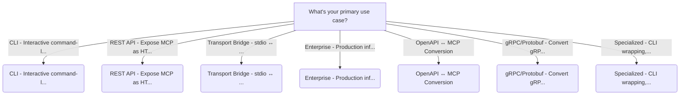
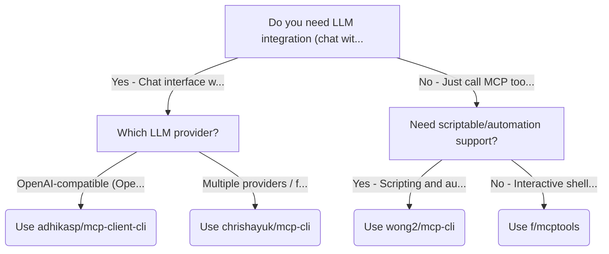
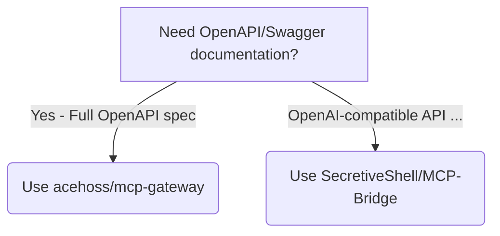
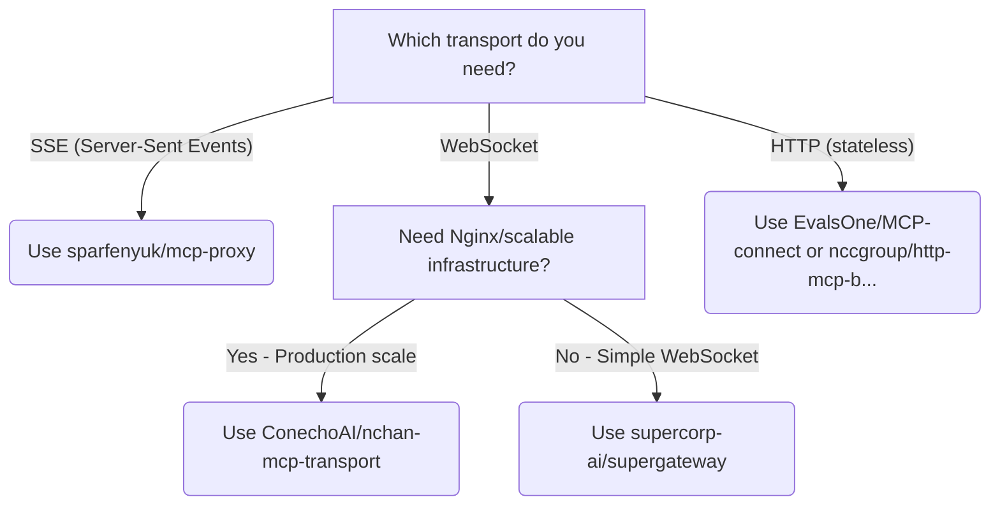
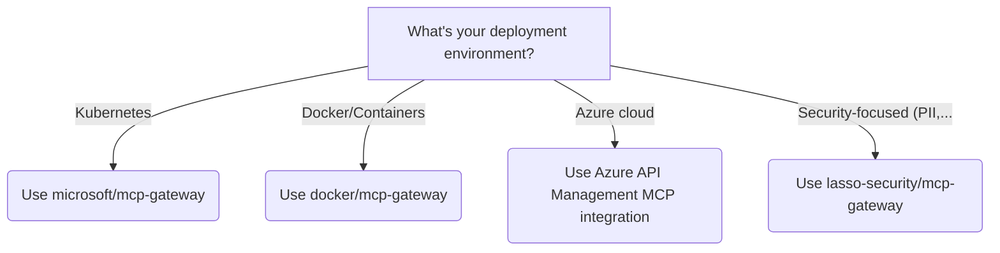
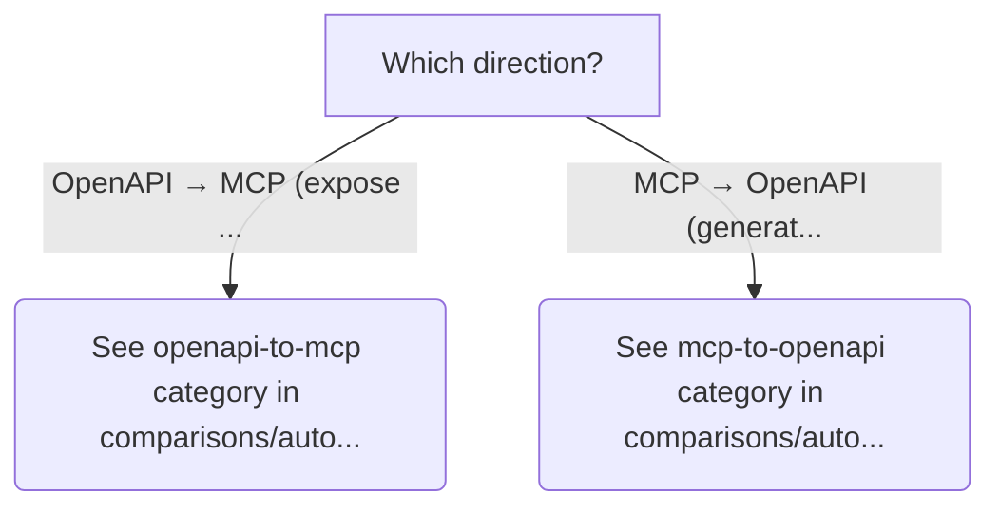
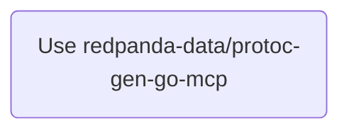
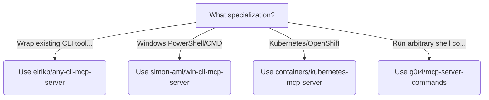

# Choose an MCP Ecosystem Tool

Interactive guide to selecting the right tool from 38+ MCP ecosystem projects

## Quick Navigation

Click a category below to jump to its decision tree:

* [CLI - Interactive command-line usage](#section-0)
* [REST API - Expose MCP as HTTP endpoints](#section-1)
* [Transport Bridge - stdio ↔ HTTP/SSE/WebSocket](#section-2)
* [Enterprise - Production infrastructure](#section-3)
* [OpenAPI ↔ MCP Conversion](#section-4)
* [gRPC/Protobuf - Convert gRPC to MCP](#section-5)
* [Specialized - CLI wrapping, Windows, Kubernetes](#section-6)

## Overview

## CLI - Interactive command-line usage {#section-0}

## REST API - Expose MCP as HTTP endpoints {#section-1}

## Transport Bridge - stdio ↔ HTTP/SSE/WebSocket {#section-2}

## Enterprise - Production infrastructure {#section-3}

## OpenAPI ↔ MCP Conversion {#section-4}

## gRPC/Protobuf - Convert gRPC to MCP {#section-5}

## Specialized - CLI wrapping, Windows, Kubernetes {#section-6}

---

**Other views:** [Unfoldable Tree](decision-tree-unfoldable.md) | [Full Tables](auto-generated.md)

*Auto-generated from `r-and-d/decision-tree-generator/examples/mcp-tool-chooser.yaml`*