# Choose an MCP Ecosystem Tool

Interactive guide to selecting the right tool from 38+ MCP ecosystem projects

## Interactive Decision Tree

Use this flowchart to find the right MCP ecosystem tool for your needs.

```mermaid
%% Decision Tree: Choose an MCP Ecosystem Tool
%% Generated from: mcp_tool_chooser

flowchart TD
    mcp_tool_chooser_root["What's your primary use case?"]
    mcp_tool_chooser_root -->|"CLI - Interactive comm..."| mcp_tool_chooser_0
    mcp_tool_chooser_0["Do you need LLM integration (chat wit..."]
    mcp_tool_chooser_0 -->|"Yes - Chat interface w..."| mcp_tool_chooser_0_0
    mcp_tool_chooser_0_0["Which LLM provider?"]
    mcp_tool_chooser_0_0 -->|"OpenAI-compatible (Ope..."| mcp_tool_chooser_0_0_0
    mcp_tool_chooser_0_0_0("Use adhikasp/mcp-client-cli")
    mcp_tool_chooser_0_0 -->|"Multiple providers / f..."| mcp_tool_chooser_0_0_1
    mcp_tool_chooser_0_0_1("Use chrishayuk/mcp-cli")
    mcp_tool_chooser_0 -->|"No - Just call MCP too..."| mcp_tool_chooser_0_1
    mcp_tool_chooser_0_1["Need scriptable/automation support?"]
    mcp_tool_chooser_0_1 -->|"Yes - Scripting and au..."| mcp_tool_chooser_0_1_0
    mcp_tool_chooser_0_1_0("Use wong2/mcp-cli")
    mcp_tool_chooser_0_1 -->|"No - Interactive shell..."| mcp_tool_chooser_0_1_1
    mcp_tool_chooser_0_1_1("Use f/mcptools")
    mcp_tool_chooser_root -->|"REST API - Expose MCP ..."| mcp_tool_chooser_1
    mcp_tool_chooser_1["Need OpenAPI/Swagger documentation?"]
    mcp_tool_chooser_1 -->|"Yes - Full OpenAPI spec"| mcp_tool_chooser_1_0
    mcp_tool_chooser_1_0("Use acehoss/mcp-gateway")
    mcp_tool_chooser_1 -->|"OpenAI-compatible API ..."| mcp_tool_chooser_1_1
    mcp_tool_chooser_1_1("Use SecretiveShell/MCP-Bridge")
    mcp_tool_chooser_root -->|"Transport Bridge - std..."| mcp_tool_chooser_2
    mcp_tool_chooser_2["Which transport do you need?"]
    mcp_tool_chooser_2 -->|"SSE (Server-Sent Events)"| mcp_tool_chooser_2_0
    mcp_tool_chooser_2_0("Use sparfenyuk/mcp-proxy")
    mcp_tool_chooser_2 -->|"WebSocket"| mcp_tool_chooser_2_1
    mcp_tool_chooser_2_1["Need Nginx/scalable infrastructure?"]
    mcp_tool_chooser_2_1 -->|"Yes - Production scale"| mcp_tool_chooser_2_1_0
    mcp_tool_chooser_2_1_0("Use ConechoAI/nchan-mcp-transport")
    mcp_tool_chooser_2_1 -->|"No - Simple WebSocket"| mcp_tool_chooser_2_1_1
    mcp_tool_chooser_2_1_1("Use supercorp-ai/supergateway")
    mcp_tool_chooser_2 -->|"HTTP (stateless)"| mcp_tool_chooser_2_2
    mcp_tool_chooser_2_2("Use EvalsOne/MCP-connect or nccgroup/http-mcp-b...")
    mcp_tool_chooser_root -->|"Enterprise - Productio..."| mcp_tool_chooser_3
    mcp_tool_chooser_3["What's your deployment environment?"]
    mcp_tool_chooser_3 -->|"Kubernetes"| mcp_tool_chooser_3_0
    mcp_tool_chooser_3_0("Use microsoft/mcp-gateway")
    mcp_tool_chooser_3 -->|"Docker/Containers"| mcp_tool_chooser_3_1
    mcp_tool_chooser_3_1("Use docker/mcp-gateway")
    mcp_tool_chooser_3 -->|"Azure cloud"| mcp_tool_chooser_3_2
    mcp_tool_chooser_3_2("Use Azure API Management MCP integration")
    mcp_tool_chooser_3 -->|"Security-focused (PII,..."| mcp_tool_chooser_3_3
    mcp_tool_chooser_3_3("Use lasso-security/mcp-gateway")
    mcp_tool_chooser_root -->|"OpenAPI ↔ MCP Conversion"| mcp_tool_chooser_4
    mcp_tool_chooser_4["Which direction?"]
    mcp_tool_chooser_4 -->|"OpenAPI → MCP (expose ..."| mcp_tool_chooser_4_0
    mcp_tool_chooser_4_0("See openapi-to-mcp category in comparisons/auto...")
    mcp_tool_chooser_4 -->|"MCP → OpenAPI (generat..."| mcp_tool_chooser_4_1
    mcp_tool_chooser_4_1("See mcp-to-openapi category in comparisons/auto...")
    mcp_tool_chooser_root -->|"gRPC/Protobuf - Conver..."| mcp_tool_chooser_5
    mcp_tool_chooser_5("Use redpanda-data/protoc-gen-go-mcp")
    mcp_tool_chooser_root -->|"Specialized - CLI wrap..."| mcp_tool_chooser_6
    mcp_tool_chooser_6["What specialization?"]
    mcp_tool_chooser_6 -->|"Wrap existing CLI tool..."| mcp_tool_chooser_6_0
    mcp_tool_chooser_6_0("Use eirikb/any-cli-mcp-server")
    mcp_tool_chooser_6 -->|"Windows PowerShell/CMD"| mcp_tool_chooser_6_1
    mcp_tool_chooser_6_1("Use simon-ami/win-cli-mcp-server")
    mcp_tool_chooser_6 -->|"Kubernetes/OpenShift"| mcp_tool_chooser_6_2
    mcp_tool_chooser_6_2("Use containers/kubernetes-mcp-server")
    mcp_tool_chooser_6 -->|"Run arbitrary shell co..."| mcp_tool_chooser_6_3
    mcp_tool_chooser_6_3("Use g0t4/mcp-server-commands")
```

## How to Use

1. Start at the top: "What's your primary use case?"
2. Follow the arrows based on your answers
3. Arrive at a recommended tool

## Need More Details?

* [Full comparison tables](auto-generated.md)
* [Security analysis](security.md)
* [Authentication guide](authentication.md)

---
*Auto-generated from `r-and-d/decision-tree-generator/examples/mcp-tool-chooser.yaml`*
