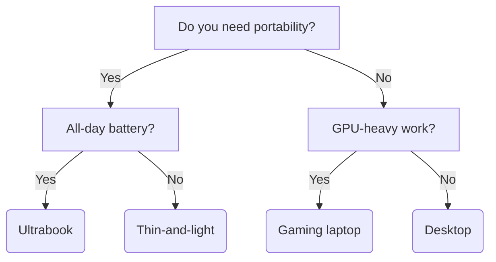

# Decision Tree Generator

**Deterministic, reproducible** decision tree generation from structured YAML data.

## Key Features

* **Deterministic** - Same input YAML always produces identical output (byte-for-byte)
* **Reproducible** - No randomness, timestamps, or environment-dependent values
* **Multiple Formats** - Mermaid, Graphviz DOT, HTML `<details>`
* **Unit Tested** - Comprehensive tests for determinism and validation
* **Reusable** - Python package with CLI and library interfaces

## Installation

```bash
# As a package (from this directory)
pip install -e .

# Or just use directly with Python path
export PYTHONPATH=/path/to/decision-tree-generator:$PYTHONPATH
```

## Quick Start

### Command Line

```bash
# Render to Mermaid flowchart
./renderers/to-mermaid.py examples/laptop-chooser.yaml

# Render to Graphviz DOT (pipe to dot for SVG)
./renderers/to-graphviz.py examples/laptop-chooser.yaml | dot -Tsvg > laptop.svg

# Render to HTML with interactive <details>
./renderers/to-html-details.py examples/laptop-chooser.yaml --full-page > laptop.html
```

### Python Library

```python
from decision_tree import load_tree, render_mermaid, render_html, render_graphviz

# Load from YAML file
tree = load_tree('examples/laptop-chooser.yaml')

# Or from dict
tree = {
    'tree': {
        'id': 'my-tree',
        'title': 'My Decision Tree',
        'root': {
            'question': 'What do you need?',
            'branches': [
                {'condition': 'Option A', 'next': {'leaf': 'Do this'}},
                {'condition': 'Option B', 'next': {'leaf': 'Do that'}}
            ]
        }
    }
}

# Render to different formats
print(render_mermaid(tree))           # Mermaid flowchart
print(render_graphviz(tree))          # DOT format
print(render_html(tree, full_page=True))  # Full HTML page
```

## YAML Format

```yaml
tree:
  id: my-decision-tree     # Required: unique identifier
  title: "Choose a Tool"   # Required: display title

  root:                    # Required: root node
    question: "What's your use case?"
    branches:
      - condition: "CLI usage"
        next:
          question: "Need LLM integration?"
          branches:
            - condition: "Yes"
              next:
                leaf: "Use tool-a"
            - condition: "No"
              next:
                leaf: "Use tool-b"

      - condition: "REST API"
        next:
          leaf-structured:         # Rich leaf with metadata
            recommendation: "Use tool-c"
            projects:
              - org/project-c
              - org/project-d
            notes: "Both support OpenAPI"
```

## Testing

```bash
# Run the test suite
python3 run_tests.py

# Expected output:
# Testing determinism...
#   ✓ Mermaid: 10 runs identical
#   ✓ Graphviz: 10 runs identical
#   ...
# ALL TESTS PASSED ✓
```

### Determinism Guarantees

The test suite verifies:

1. **Identical output** - 10 consecutive renders produce byte-identical results
2. **Hash stability** - SHA256 hash of output remains constant
3. **Direction options** - All direction variants (TD, LR, etc.) are deterministic
4. **Special characters** - Unicode and escaping handled consistently

## Directory Structure

```
decision-tree-generator/
├── decision_tree/          # Python package (reusable library)
│   ├── __init__.py         # Package exports
│   ├── loader.py           # YAML loading and validation
│   ├── mermaid.py          # Mermaid renderer
│   ├── graphviz.py         # Graphviz DOT renderer
│   ├── html_details.py     # HTML <details> renderer
│   └── cli.py              # CLI entry points
├── renderers/              # Standalone CLI scripts
├── examples/               # Example decision trees
│   ├── mcp-tool-chooser.yaml
│   └── laptop-chooser.yaml
├── tests/                  # pytest test files
├── spec/                   # Schema and design docs
├── output/                 # Generated files (gitignored)
├── run_tests.py            # Standalone test runner
└── pyproject.toml          # Package configuration
```

## Output Examples

### Mermaid



### HTML (Interactive)

The HTML renderer creates nested `<details>/<summary>` elements that expand/collapse:

```html
<details open>
  <summary>Do you need portability?</summary>
  <details>
    <summary>Yes - prioritize lightweight</summary>
    <p class="leaf">Ultrabook / MacBook Air-class device</p>
  </details>
  <details>
    <summary>No - portability not critical</summary>
    <p class="leaf">Desktop or large laptop</p>
  </details>
</details>
```

## Application to MCP Comparison

This generator powers the MCP tool selection guide:

1. **Source**: `examples/mcp-tool-chooser.yaml` contains the decision tree
2. **Categories**: CLI clients, REST bridges, enterprise gateways, etc.
3. **Render**: Generate Mermaid for README, HTML for docs site

## References

* [Mermaid Flowchart Syntax](https://mermaid.js.org/syntax/flowchart.html)
* [Graphviz DOT Language](https://graphviz.org/doc/info/lang.html)
* [HTML `<details>` element](https://developer.mozilla.org/en-US/docs/Web/HTML/Element/details)
