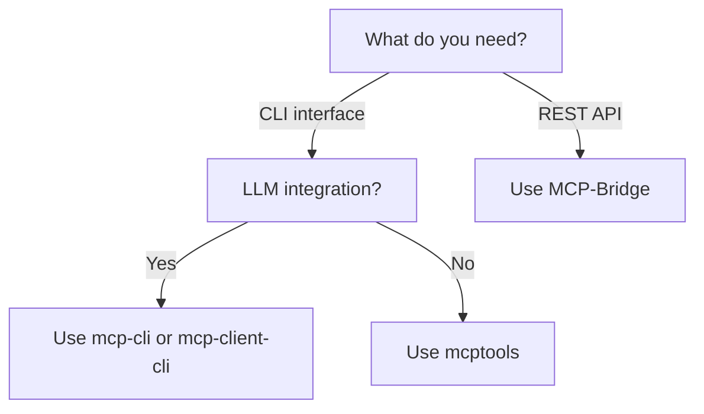
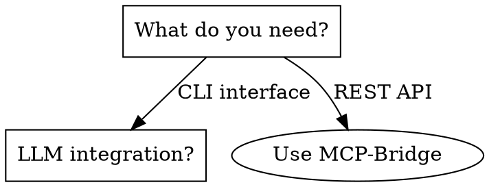

# Decision Tree Generator - Design Document

## Problem Statement

Users browsing the MCP ecosystem comparison face choice overload:

* 38+ projects across 10+ categories
* Multiple dimensions: language, transports, auth, features
* "Which tool should I use?" requires navigating complex trade-offs

**Goal**: Generate interactive decision trees that guide users to the right tool based on their specific needs.

## Design Goals

1. **Deterministic** - Same input → identical output (byte-for-byte)
2. **Reproducible** - No environment dependencies, timestamps in hashes
3. **Single source of truth** - Decision logic in YAML, not scattered in code
4. **Multiple output formats** - One tree, many representations
5. **Auto-generation capable** - Can derive trees from structured project data

## Architecture

```
┌─────────────────────────────────────────────────────────────────┐
│                        Input Sources                             │
├─────────────────────────────────────────────────────────────────┤
│  Manual YAML          Auto-generated from data                   │
│  (hand-crafted)       (projects/*.yaml → decision tree)          │
└────────────┬──────────────────────────────────────┬─────────────┘
             │                                      │
             ▼                                      ▼
┌─────────────────────────────────────────────────────────────────┐
│              Canonical Decision Tree (YAML/JSON)                 │
│                                                                  │
│  - Normalized structure                                          │
│  - Deterministic node IDs                                        │
│  - No rendering hints (pure logic)                               │
└────────────┬──────────────────────────────────────┬─────────────┘
             │                                      │
     ┌───────┴───────┬───────────────┬─────────────┴───────┐
     ▼               ▼               ▼                     ▼
┌─────────┐   ┌───────────┐   ┌───────────┐         ┌───────────┐
│ Mermaid │   │ Graphviz  │   │   HTML    │         │   TTL     │
│  .md    │   │   .dot    │   │ <details> │         │  (RDF)    │
└─────────┘   └───────────┘   └───────────┘         └───────────┘
```

## Determinism Strategy

### Node ID Generation

```python
def generate_node_id(tree_id: str, path: list[int]) -> str:
    """Generate deterministic node ID from tree ID and branch path.

    Args:
        tree_id: The tree's unique identifier (e.g., "mcp-chooser")
        path: List of branch indices from root (e.g., [0, 1, 0])

    Returns:
        Deterministic ID like "mcp-chooser-0-1-0"
    """
    if not path:
        return f"{tree_id}-root"
    return f"{tree_id}-{'-'.join(map(str, path))}"
```

### Output Consistency

* Sort keys in JSON/YAML output alphabetically (optional flag)
* Use consistent newline style (LF)
* No timestamps in output (only in metadata, excluded from content hash)
* Renderer version in output header for reproducibility

## YAML Schema Design

### Why YAML over JSON?

* Human-readable and editable
* Comments for documentation
* Multi-line strings without escaping
* Widely supported

### Node Types

```yaml
# Decision Node (question with branches)
question: "What transport do you need?"
branches:
  - condition: "stdio only"
    next: { leaf: "Most CLI tools support stdio" }
  - condition: "HTTP/SSE"
    next: { question: "..." }

# Leaf Node (terminal recommendation)
leaf: "Use sparfenyuk/mcp-proxy"

# Structured Leaf (rich recommendation)
leaf-structured:
  recommendation: "Use MCP-Bridge for REST exposure"
  projects:
    - SecretiveShell/MCP-Bridge
    - acehoss/mcp-gateway
  notes: "Both support OpenAPI generation"
```

## Renderer Specifications

### Mermaid Renderer



Output characteristics:

* `flowchart TD` (top-down) or `LR` (left-right)
* Square brackets for questions: `[question text]`
* Edge labels for conditions: `-->|condition|`
* Rounded brackets for leaves: `(recommendation)`

### Graphviz Renderer



Output characteristics:

* `digraph` for directed graph
* Consistent node naming: `n_{path}` or semantic IDs
* Questions as boxes, leaves as ellipses
* UTF-8 safe labels

### HTML Details Renderer

```html
<details open>
  <summary>What do you need?</summary>
  <details>
    <summary>CLI interface</summary>
    <details>
      <summary>LLM integration?</summary>
      <p class="leaf">Yes → Use mcp-cli</p>
      <p class="leaf">No → Use mcptools</p>
    </details>
  </details>
  <details>
    <summary>REST API</summary>
    <p class="leaf">Use MCP-Bridge</p>
  </details>
</details>
```

Output characteristics:

* Semantic HTML5
* CSS classes for styling hooks
* `open` attribute on root only (configurable)
* Accessible (`aria-label` on container)

## Auto-Generation from Project Data

### Phase 1: Manual Trees

Hand-craft decision trees based on domain knowledge:

```yaml
tree:
  id: mcp-tool-chooser
  title: "Choose an MCP Tool"
  root:
    question: "What's your primary use case?"
    branches:
      - condition: "Interactive CLI usage"
        next: ...
```

### Phase 2: Semi-Automated

Generate candidate trees from project metadata:

```python
def generate_tree_from_categories(projects):
    """Generate decision tree based on project categories."""
    categories = group_by_category(projects)

    return {
        'question': "What type of tool do you need?",
        'branches': [
            {
                'condition': category_display_name(cat),
                'next': generate_category_subtree(projects)
            }
            for cat in sorted(categories.keys())
        ]
    }
```

### Phase 3: Fully Automated

Use feature vectors to build optimal decision trees:

```python
# Features: category, language, transports, auth, stars
# Use information gain to determine best split at each node
```

## File Formats

### Input: `examples/*.yaml`

```yaml
tree:
  id: mcp-tool-chooser
  title: "Choose an MCP Tool"
  description: "Interactive guide to selecting the right MCP ecosystem tool"
  root:
    question: "What's your primary use case?"
    branches: [...]
```

### Output: Canonical YAML

Same structure, but normalized:

* Keys sorted alphabetically (optional)
* Consistent indentation (2 spaces)
* No trailing whitespace
* Single newline at EOF

### Output: TTL (Turtle RDF)

```turtle
@prefix dt: <http://example.org/decision-tree#> .
@prefix mcp: <http://example.org/mcp-tools#> .

mcp:mcp-tool-chooser a dt:DecisionTree ;
    dt:title "Choose an MCP Tool" ;
    dt:root mcp:mcp-tool-chooser-root .

mcp:mcp-tool-chooser-root a dt:DecisionNode ;
    dt:question "What's your primary use case?" ;
    dt:hasBranch mcp:mcp-tool-chooser-0, mcp:mcp-tool-chooser-1 .
```

## Testing Strategy

### Determinism Tests

```python
def test_determinism():
    """Same input must produce identical output."""
    input_yaml = load("examples/mcp-tool-chooser.yaml")

    output1 = render_mermaid(input_yaml)
    output2 = render_mermaid(input_yaml)

    assert output1 == output2
    assert hashlib.sha256(output1).hexdigest() == hashlib.sha256(output2).hexdigest()
```

### Snapshot Tests

Store expected outputs and compare:

```
tests/snapshots/
├── mcp-tool-chooser.mermaid.md
├── mcp-tool-chooser.dot
└── mcp-tool-chooser.html
```

## Future Directions

* **Interactive web component** - React/Vue component for tree navigation
* **Analytics integration** - Track which paths users take
* **A/B testing** - Test different tree structures
* **LLM-assisted tree generation** - Use Claude to suggest decision criteria
* **Bidirectional sync** - Edit rendered tree, update YAML source
